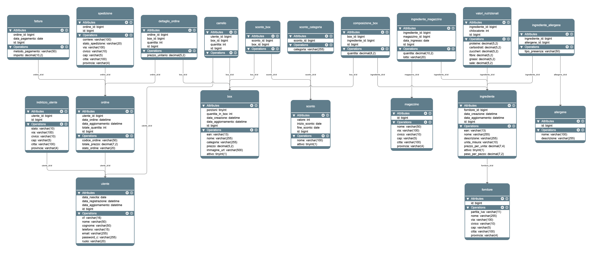

# 🗄️ Yumaste — Database

Questo repository contiene lo schema del database relazionale, i file DDL e DML del progetto **Yumaste**, un e-commerce di meal kit (box di ingredienti con ricette) sviluppato con architettura multi-repo.

---

## 📦 Struttura del Repository

| File | Descrizione |
|------|-------------|
| `DDL.sql` | Data Definition Language — creazione di tutte le tabelle, vincoli, chiavi esterne e check |
| `DML.sql` | Data Manipulation Language — dati di esempio (seed) per popolamento iniziale del DB |
| `UML_SCHEMA_YUMASTE.png` | Schema UML/ER del database |

---

## 🧩 Schema del Database

Lo schema è composto da **19 tabelle** che coprono l'intera logica di business dell'e-commerce:

### Catalogo e Prodotti
- **`box`** — Prodotti venduti (meal kit), con EAN, categoria, porzioni, prezzo e stato attivo
- **`ingrediente`** — Ingredienti che compongono i box, con EAN, fornitore, prezzo per unità e peso
- **`composizione_box`** — Relazione N:M tra box e ingredienti con le quantità richieste
- **`valori_nutrizionali`** — Macronutrienti e chilocalorie per ogni ingrediente

### Allergeni
- **`allergene`** — Registro degli allergeni (es. Glutine, Lattosio, Frutta a guscio)
- **`ingrediente_allergene`** — Associazione ingrediente ↔ allergene con tipo di presenza (`PRESENTE`, ecc.)

### Utenti e Indirizzi
- **`utente`** — Anagrafica utenti con CF, email, password hashata e ruolo (`USER` / `ADMIN`)
- **`indirizzo_utente`** — Indirizzi di consegna degli utenti (stato `attivo` / `inattivo`)

### Carrello e Ordini
- **`carrello`** — Contenuto del carrello attivo per ogni utente
- **`ordine`** — Ordini con codice univoco, stato (`IN_ATTESA`, `PAGATO`, `SPEDITO`, `CONSEGNATO`, `ANNULLATO`) e totali
- **`dettaglio_ordine`** — Righe d'ordine con box, quantità e prezzo unitario al momento dell'acquisto

### Pagamenti e Spedizioni
- **`fattura`** — Fattura associata all'ordine con metodo di pagamento e importo
- **`spedizione`** — Tracking spedizione con corriere, stato (`IN_PREPARAZIONE`, `IN_TRANSITO`, `IN_CONSEGNA`, `CONSEGNATO`) e indirizzo

### Sconti
- **`sconto`** — Sconti con valore percentuale, periodo di validità e stato attivo
- **`sconto_box`** — Sconto applicato a specifici box
- **`sconto_categoria`** — Sconto applicato a intere categorie di box

### Magazzino e Fornitori
- **`fornitore`** — Anagrafica fornitori con P.IVA e sede
- **`magazzino`** — Sedi di magazzino
- **`ingrediente_magazzino`** — Giacenze di magazzino per ingrediente, con lotto e data ingresso

---

## 🗺️ Schema UML



---

## 🚀 Setup del Database

### Prerequisiti
- MySQL 8.0+

### Installazione

1. Crea il database:
   ```sql
   CREATE DATABASE yumaste CHARACTER SET utf8mb4 COLLATE utf8mb4_unicode_ci;
   USE yumaste;
   ```

2. Esegui il DDL per creare le tabelle:
   ```bash
   mysql -u <utente> -p yumaste < DDL.sql
   ```

3. *(Opzionale)* Popola il database con i dati di esempio:
   ```bash
   mysql -u <utente> -p yumaste < DML.sql
   ```

---

## 🔗 Repository del Progetto

Yumaste è un progetto multi-repo. Di seguito le altre repository collegate:

>Link al backend: https://github.com/SantoFemiano/yumaste-backend
>Link al front-end (client): https://github.com/SantoFemiano/yumaste-shop
>Link al front-end (admin): https://github.com/SantoFemiano/yumasteadminshop
---

## 🛠️ Tecnologie

- **DBMS:** MySQL 8.0
- **Backend:** Spring Boot (JPA / Hibernate)
- **Diagrammi:** UML / ER

---

## 👤 Autori

**Santo Femiano**
- GitHub: [@SantoFemiano](https://github.com/SantoFemiano)
  
**Salvatore Santaniello**
- GitHub: [@salvsant](https://github.com/salvsant)
---

